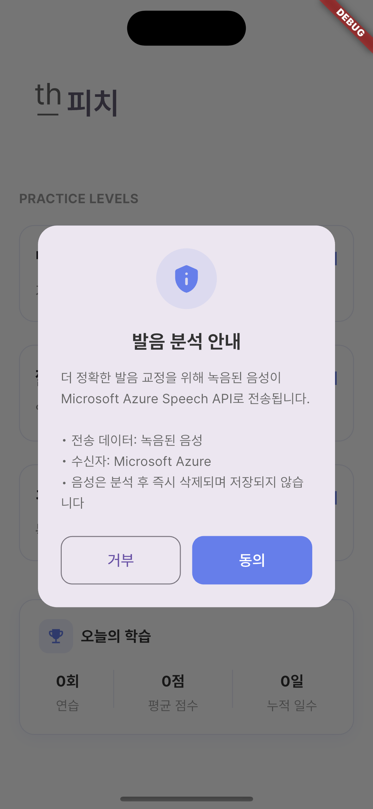
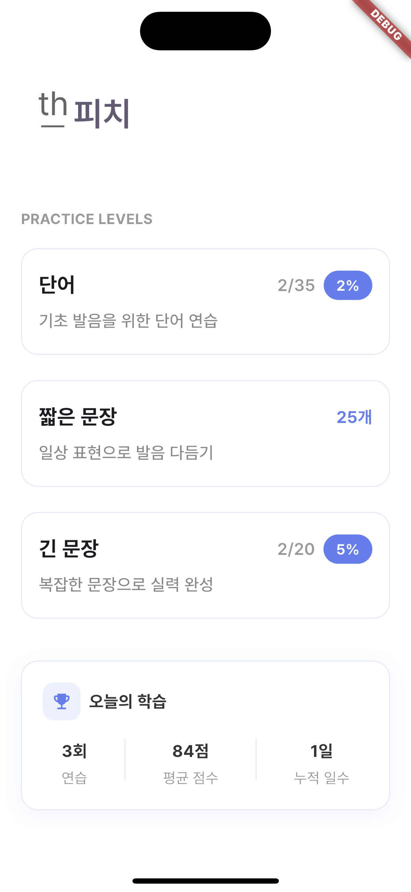
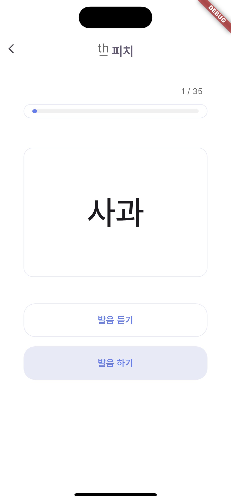
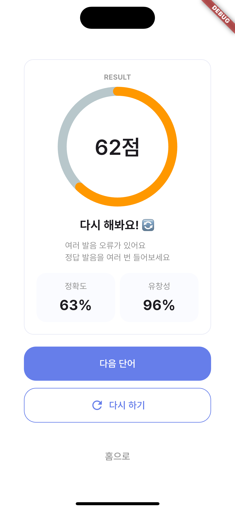

# th_pronounce_app (-th 발음 교정 앱)

한국어 'ㅅ' 발음을 영어 'th'(θ, ð) 발음처럼 새는 습관을 교정하기 위한 Flutter 발음 연습 앱입니다.

사용자가 단어·문장을 듣고 따라 말하면 Microsoft Azure Speech(Pronunciation Assessment)로 발음을 분석하고, 특히 'ㅅ' 음소가 영어 'th' 발음으로 새어 나오는지를 감지해 맞춤 피드백을 제공합니다.

## 목차

- [th\_pronounce\_app (-th 발음 교정 앱)](#th_pronounce_app--th-발음-교정-앱)
  - [목차](#목차)
  - [스크린샷](#스크린샷)
  - [주요 기능](#주요-기능)
  - [기술 스택](#기술-스택)
  - [프로젝트 구조](#프로젝트-구조)
  - [설치 방법](#설치-방법)
    - [사전 요구 사항](#사전-요구-사항)
    - [1. 저장소 클론 및 패키지 설치](#1-저장소-클론-및-패키지-설치)
    - [2. Firebase 설정](#2-firebase-설정)
    - [3. 플랫폼별 권한 확인](#3-플랫폼별-권한-확인)
  - [실행 방법](#실행-방법)
  - [사용법](#사용법)
  - [빌드](#빌드)
  - [테스트](#테스트)

## 스크린샷

| 개인정보 동의 | 홈 | 연습 | 결과 |
| --- | --- | --- | --- |
|  |  |  |  |

## 주요 기능

- **3단계 연습 레벨**: 단어 → 짧은 문장 → 긴 문장 순으로 난이도가 올라가는 발음 연습 콘텐츠 제공
- **TTS 예시 발음 재생**: `flutter_tts`로 정확한 한국어 발음을 먼저 듣고 따라 말할 수 있음
- **녹음 및 발음 분석**: 마이크로 녹음한 음성을 Azure Speech Pronunciation Assessment API로 전송해 정확도·유창성·완성도·종합 점수를 산출
- **'th' 발음 오류 감지 및 감점**: 인식된 음소 중 θ/ð가 검출되면 감점 및 전용 교정 피드백(`ResultModel.getFeedbackDetail`) 제공
- **무관한 발화 필터링**: 완성도 점수가 낮으면(`completeness < 30`) `IrrelevantSpeechException`을 던져 재시도를 유도
- **학습 진행도 저장**: 레벨별 진행 인덱스, 오늘의 연습 횟수, 평균 점수, 연속 연습 일수를 로컬(`shared_preferences`)에 저장
- **최초 실행 시 개인정보(음성 데이터) 처리 동의 다이얼로그** 제공
- **원격 설정(Firebase Remote Config)**: Azure API Key/Region을 앱 배포 후에도 코드 변경 없이 교체 가능

## 기술 스택

| 영역 | 사용 기술 |
| --- | --- |
| 프레임워크 | Flutter (Dart SDK `^3.9.2`) |
| 음성 인식/평가 | Microsoft Azure Cognitive Services Speech (Pronunciation Assessment REST API) |
| 음성 합성 | `flutter_tts` |
| 녹음 | `record`, `permission_handler`, `path_provider` |
| 원격 설정 | `firebase_core`, `firebase_remote_config` |
| 로컬 저장소 | `shared_preferences` |
| UI | `flutter_svg`, `percent_indicator`, `fluttertoast` |

## 프로젝트 구조

```
lib/
├── data/                 # 단어/문장 연습 데이터 (word, short_sentence, long_sentence)
├── model/                # ResultModel, WordDataModel 등 데이터 모델
├── screens/              # HomeScreen, PracticeScreen, ResultScreen
├── service/
│   ├── azure_speech_service.dart  # Azure Pronunciation Assessment 연동, th 오발음 판별
│   ├── config_service.dart        # Firebase Remote Config (Azure Key/Region)
│   ├── consent_service.dart       # 개인정보 처리 동의 여부 저장
│   ├── progress_service.dart      # 레벨별 학습 진행도
│   ├── recording_service.dart     # 마이크 권한, 녹음 시작/중지
│   ├── stats_service.dart         # 오늘의 연습 횟수, 평균 점수, 연습 일수
│   └── tts_service.dart           # 예시 발음 재생
└── widget/               # 화면 구성 위젯 (레벨 카드, 통계, 녹음 버튼 등)
```

## 설치 방법

### 사전 요구 사항

- Flutter SDK (3.35 이상 권장, Dart `^3.9.2`)
- Xcode (iOS 빌드 시) / Android Studio + Android SDK (Android 빌드 시)
- Firebase 프로젝트 (Remote Config 사용)
- Microsoft Azure Speech 리소스 (구독 키, 리전)

### 1. 저장소 클론 및 패키지 설치

```bash
git clone <repository-url>
cd th_pronounce_app
flutter pub get
```

### 2. Firebase 설정

이 프로젝트는 `firebase_options.dart`, `GoogleService-Info.plist`, `google-services.json`이 `.gitignore`에 포함되어 저장소에 커밋되지 않습니다. 아래 명령으로 각자 Firebase 프로젝트 기준으로 생성해야 합니다.

```bash
dart pub global activate flutterfire_cli
flutterfire configure
```

Azure Speech Key/Region은 Firebase Remote Config(`azure_speech_key`, `azure_speech_region`)로 관리되므로, Firebase 프로젝트만 정상 연결되면 별도 등록 없이 값을 가져옵니다. 앱은 오프라인/미설정 상태에서도 크래시 없이 "오프 모드"로 기동되며, `ConfigService.isConfigured`가 `false`면 발음 분석 요청 시 에러가 반환됩니다.

### 3. 플랫폼별 권한 확인

- iOS: `ios/Runner/Info.plist`의 `NSMicrophoneUsageDescription`
- Android: `android/app/src/main/AndroidManifest.xml`의 `RECORD_AUDIO`, `INTERNET` 권한

두 항목 모두 이미 설정되어 있으므로 별도 작업은 필요 없습니다.

## 실행 방법

```bash
flutter run
```

특정 기기를 지정하려면:

```bash
flutter devices
flutter run -d <device-id>
```

## 사용법

1. 앱 최초 실행 시 음성 데이터 처리에 대한 개인정보 동의 다이얼로그에 동의합니다.
2. 홈 화면에서 연습 레벨(단어 / 짧은 문장 / 긴 문장)을 선택합니다.
3. "발음 듣기"로 정확한 예시 발음을 먼저 듣습니다.
4. 녹음 버튼을 눌러 따라 말하고, 다시 눌러 녹음을 종료하면 자동으로 분석이 시작됩니다.
5. 결과 화면에서 종합 점수와 함께, 'ㅅ'을 'th'로 잘못 발음했는지 여부에 따른 맞춤 피드백을 확인합니다.
6. "다음"으로 다음 문항으로 이동하며, 레벨을 모두 완료하면 완료 다이얼로그가 표시됩니다.
7. 홈 화면 하단에서 오늘의 연습 횟수, 평균 점수, 연습 일수 등 누적 통계를 확인할 수 있습니다.

## 빌드

```bash
# Android
flutter build apk --release
flutter build appbundle --release

# iOS
flutter build ipa --release
```

## 테스트

```bash
flutter test
```
